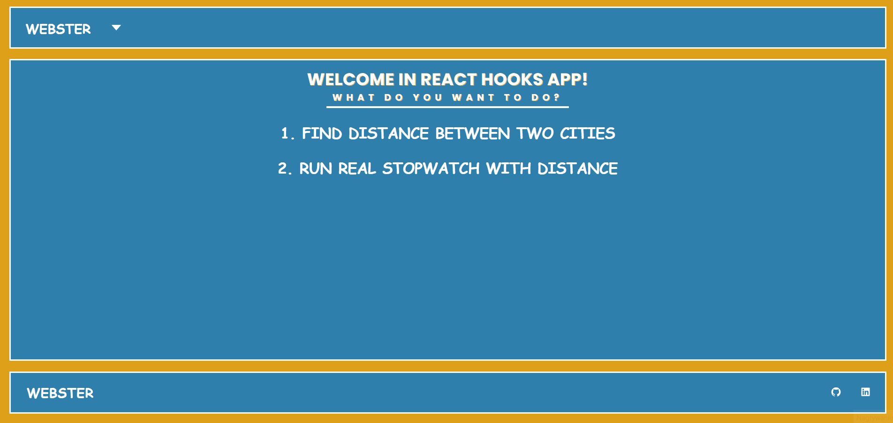
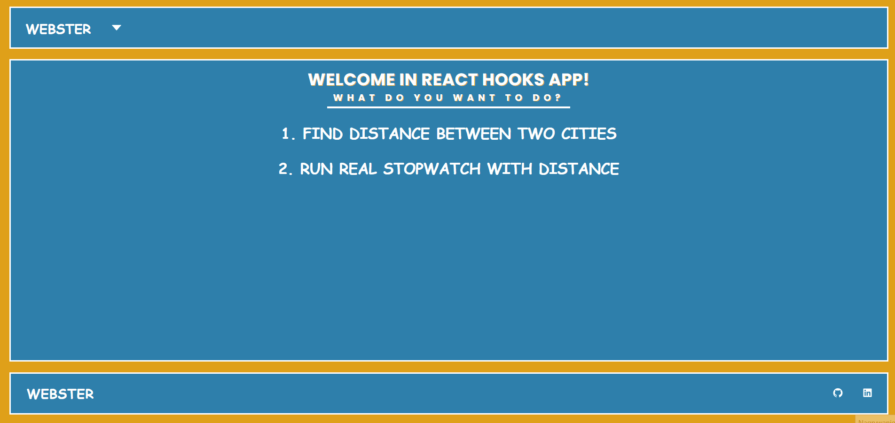

# REACT HOOKS APP WITH MAPS

REACT HOOKS APP WITH MAPS is an application to finding city on map, calculate distance between two cities and check travel time of inputed distance and velocity. Instruction how use app are in home page as sliders. I created this application to train my skills in REACT HOOKS and to create something usefull. This project was prepared mainly with React.js library. Project is divided into components with scss styling files and JS files.

## How it works

## Link
https://webster2020-react-hooks-app.herokuapp.com/

## How to start:
1. git clone git@github.com:Webster2020/REACT_HOOKS_APP_WITH_MAPS.git
2. npm install
3. npm start - run the project and than You can see it on Your device

*...or use link if You only want to check how it works

## Used technologies:
 1. React with Hooks - as main library
 2. SCSS - for styling
 3. Styled components - for styling FooterBar
 4. HTML5 - for content
 5. React Router - for routing
 6. React Icons
 7. Google Map React - to show data on maps
 8. Cities.json - to get data about biggest cities
 9. Eslint - to control bugs
 10. Husky - to control bugs before every commit
 11. Lint Staged - to check only changed files
 12. Webpack as bundler
 13. Babel as transpiler

## Implemented solutions:
Application is divided into four views: home, sliders, map and stopwatch. Navbar on the top to switch between views.
 1. Home:
 - sliders to select
 2. Sliders:
 - instructions how chosen part of app works
 - instructions as sliders (sliders create with timeout and interval)
 3. Map: 
 - map is displayed thanks to google-map-react
 - in navbar there are panels to select city (by input) and to change some properities of map view
 - on map there are buttons to calculate distance, turn on full screen mode, zoom map in and out
 4. Stopwatch:
 - clock with movable hands of the clock
 - form with inputs to input distance and velocity, buttons to choose speed of time lapse, run/stop clock and reset all
 - distance bar shows distance traveled in every second of time  

## Project architecture
Project is not divided into components in accordance with the React convention.
 1. components with JS, JSX and SCSS
 2. root file: index.html
 3. others functions in utils
 4. configuration files: gitignore, package.json, babel, webpack etc.

## How did I create this project?
Project was prepared based on my own idea and using my current knowledge and skills.

## Plan for future development
 - Validation of form inputs
 - New functionalities

## Authors
* **Michal Szwajgier** - *Webster2020* - 

## License
Free licence

# TODO
- add new functionality
- upgrade timer
